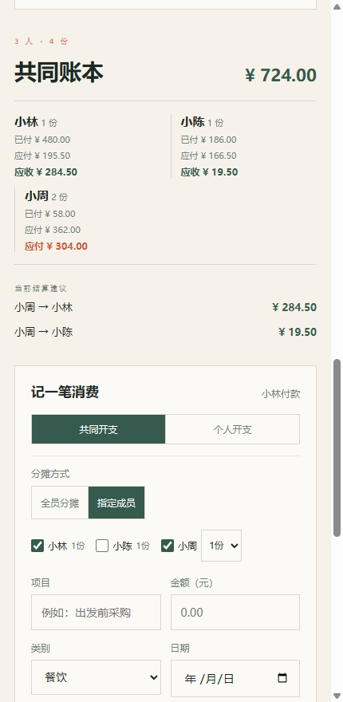
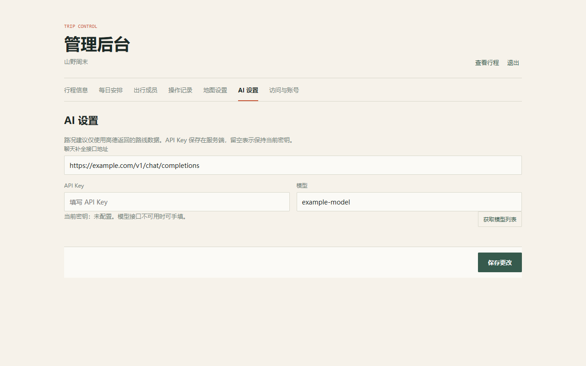

# TripWeave

**路线一起走，花费算得清。**

面向自驾结伴出行的行程与共同账本。手机上查看每日路线、实时路况和到达时间，同行人按实际承担份数记录、分摊费用；管理员在网页后台维护行程和服务配置。

适合朋友结伴自驾、家庭出游，以及希望自己托管行程数据的小团队。

## 能做什么

- **每日行程**：展示多日计划、分段路线、用餐与住宿；手机端可从当前位置重新规划。
- **高德地图**：Web JS API 绘制驾车路线、备选路线和路况图层，显示路段拥堵摘要。
- **AI 路况建议**：仅把高德返回的路线和分段路况作为分析依据；建议缓存并异步刷新。AI 服务可选。
- **共同账本**：共同或个人开支、按成员指定承担份数、付款人与承担人分离、AA 结算与 CSV 导出。
- **管理后台**：编辑行程、成员、访问码、管理员用户名与密码、高德和 AI 配置；可搜索高德地点作为路线起终点。
- **独立安装**：每个实例通过 `/install` 初始化，数据保存在 PostgreSQL。

## 界面预览

以下是实际界面的本地截图，使用虚构行程、成员、账目和模拟接口数据；时间与费用仅用于演示，不是旅行建议。

| 手机端每日行程 | 共同账本与指定成员分摊 |
| --- | --- |
|  |  |

管理员可在后台维护每日安排、出行成员、访问与账号、地图和 AI 服务：



## 费用怎么分

付款人和承担费用的人可以不同。假设小林、小陈各 1 份，小周代表 2 人：

| 场景 | 记录方式 |
| --- | --- |
| 四个人的住宿、加油、出发前采购 | 保持默认的「共同开支 → 全员分摊」，按 1 : 1 : 2 分配 |
| 小林与小周其中一人的餐费 | 选择「指定成员」，勾选小林 1 份、小周 1 份 |
| 小林帮小陈垫付车票 | 小林记账，分摊人只选择小陈 |
| 只为自己买的纪念品 | 选择「个人开支」，不计入共同结算 |

金额按分计算，页面列出已付、应付和转账建议。系统只记录费用，不处理付款。

## 技术栈

React、TypeScript、Vite、Node.js、PostgreSQL、高德 Web 端 JS API。当前是**单实例、单行程**架构；不同团队请部署独立实例和数据库。它尚不具备多租户、订阅计费或支付能力。

## 快速开始

需要 Node.js 24+、PostgreSQL 14+。地图功能需使用你自己的高德 Web JS API Key 和安全密钥；AI 服务可选。

```bash
git clone https://github.com/evendevil66/TripWeave.git
cd TripWeave
npm ci
npm run build
npm start
```

请先创建一个独立的 PostgreSQL 数据库及账号。应用会在首次安装时创建所需数据表。

访问 `http://localhost:4173/install`，填写数据库地址、端口、库名、账号和密码，再设置行程名称、旅伴访问码、管理员用户名和至少 8 位密码。安装成功后，服务会保存数据库连接并生成 `data/install.lock`，安装入口随即关闭；管理员从 `/admin` 登录。请持久化并妥善保存 `data/` 目录。生产环境应通过 HTTPS 反向代理到 `PORT`（默认 4173），手机定位需要 HTTPS。

安装时可选择空白行程，或载入虚构的两日示例。示例住宿和费用不对应真实订单，账本初始为空。后台配置高德后，通过地点搜索选择路线起终点；AI 不配置时，仍可查看行程、账本和高德路况。

前端开发可同时运行 `npm start` 与 `npm run dev`，Vite 默认在 `http://localhost:5173`，并把业务 API 代理到 4173 端口。

```bash
npm test
npm run build
```

详细部署和升级说明见[部署说明](docs/v2-deployment.md)。

## 服务配置与数据

地图和 AI 服务由部署者在管理后台配置。行程、成员和账本保存在部署者自己的数据库中。高德地图需要在其控制台设置可用域名；地图和 AI 服务的调用量以各服务商的规则为准。

路线和路况来自高德当前返回的数据。启用 AI 后，路线与路况摘要会发送到部署者配置的模型服务，用于生成建议。

## 使用许可

© 2026 杭州猫萌特科技有限公司。TripWeave 采用 [TripWeave 源码可用许可 1.0](LICENSE)：可免费使用、修改和商用，也可销售修改后的可执行商业产品或服务；不得单独售卖原始或修改后的源码。分发时需保留原版权与许可声明，修改者保留其独立创作部分的版权。该许可含源码销售限制，不属于 OSI 认可的开源许可证。
